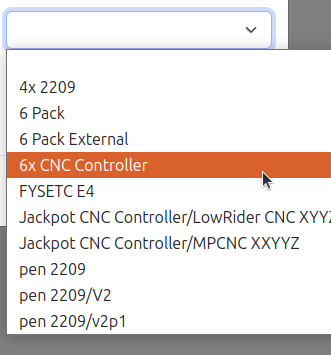
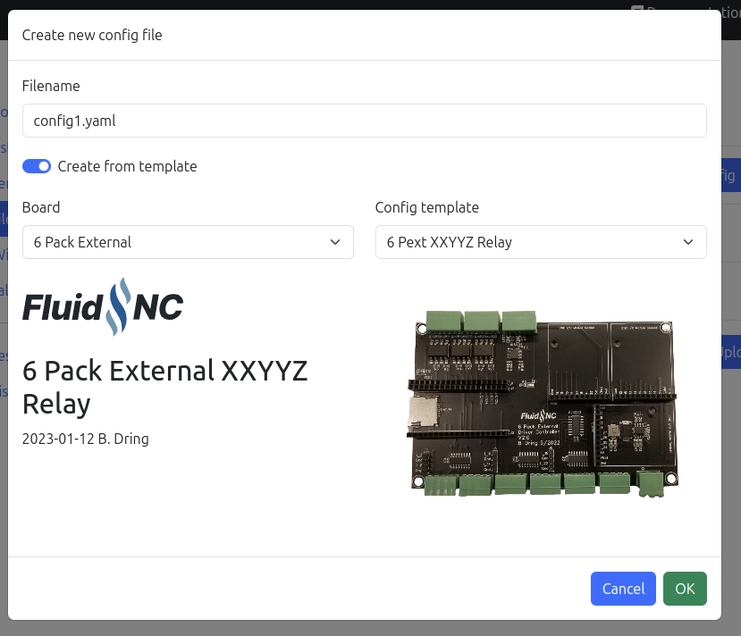

# FluidNC Configuration files.

These are configuration files for [FluidNC](https://github.com/bdring/FluidNC). You can find a full description of the format on the [FluidNC wiki](http://wiki.fluidnc.com/en/config/overview).

## Official

The official files are files that are typically used for firmware testing. They are generally maintained when there are changes or new features added to the config file format. They are not necessarily targeted at any specific machine type or user. 

## Contributed

These are files contributed by users. They are grouped by the target controller. They are not maintained or tested by the FluidNC dev team. Feel free to add your own.

## Guidelines for contributing

These config files will be used in the **FluidNC Web Installer** as configuration templates. 
By following these guidelines will make it easier for the user to select the correct configuration for their board and machine setup.

### Folder structure

The folder name will be used as a controller board name. Underlines `_` will be replaced with spaces and sub folders will be concatenated. Try to avoid any configuration specific details in the name.

```
contributed/
    4x_2209
    6_Pack/
    6_Pack_External/
    Jackpot_CNC_Controller/
        LowRider_CNC_XYYZ/
        MPCNC_XXYYZ/
    pen_2209/
        V2/
        v2p1/
```

This will be read into the **FluidNC Web Installer** and will be displayed like this:



### Files structure
Files that ends with `.yaml` will be selectable as configuration template. Try to come up with a name that indicates what is included in the config. It may for instance include if it is using a stepstick stepper driver and how many axes are configured.

You can also place image files `logo.svg` or `logo.png` and `board.png` in the directory which will further help the user to select the correct board.

### Configuration file
Try to add a user friendly description to the yaml-configuration file. The `name` and `meta` fields will be displayed in the installer:

```
board: 6 Pack
name: 6 Pack External XXYYZ Relay
meta: |-
  Configured with XYZ-axes. 
  The X- and Y-axes are ganged. 
  The spindle is configured with at relay on GPIO.25
```



